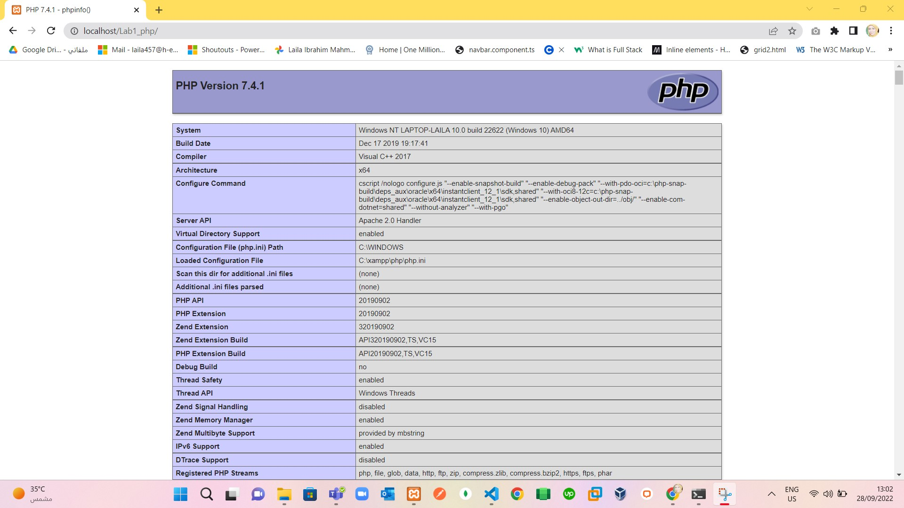
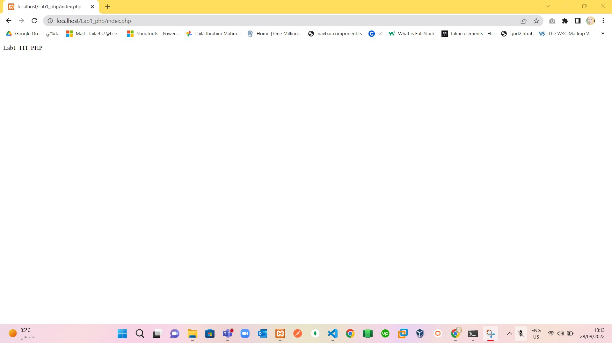
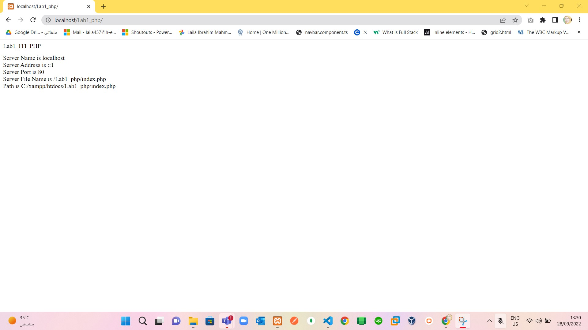
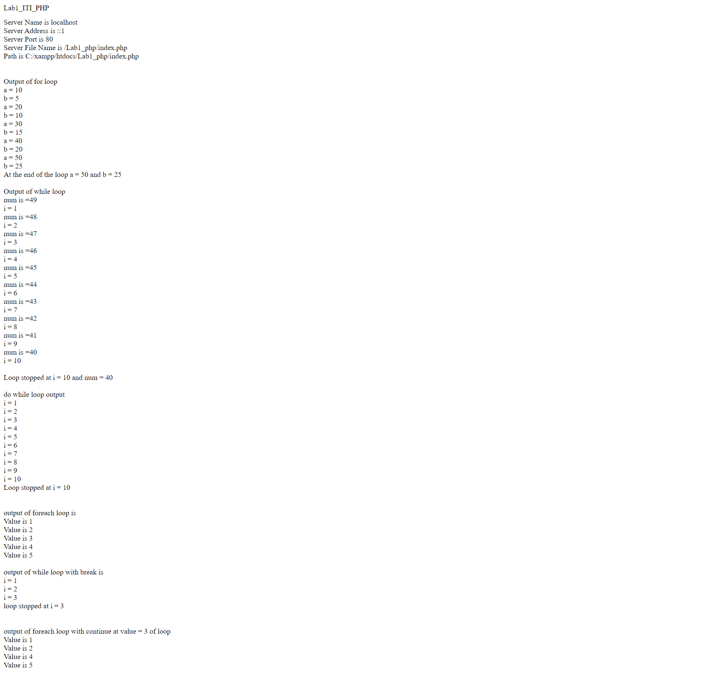

#	Show your phpinfo on browser.
> Solve as in :
  

#   Use constant to display your website name which mustn’t change across your pages.
> Solve as in:
  

#  Show your server name, address, port,filename and path of the currently executing script.
> Solve as in:
  

#  Display the output of for,while,do while and foreach fn code from demo file   
> solve as in: 
  

#   Your brother is 10 years old, If you know that :
>   age less than 5 --> Print Msg --> Stay at home,
    age equal 5 --> Print Msg --> Go to Kindergarden,
    age between 6 & 12 --> Print Msg --> Go to grade :XXX
    (Use switch case).
> Solve as in:
  1.  if $age = 10 ; print on the screen ---> Go to grade :XXX
  2.  if $age = 5; print on the screen -->  Go to Kindergarden
  3.  if $age = 2; print on the screen ---> Stay at home

